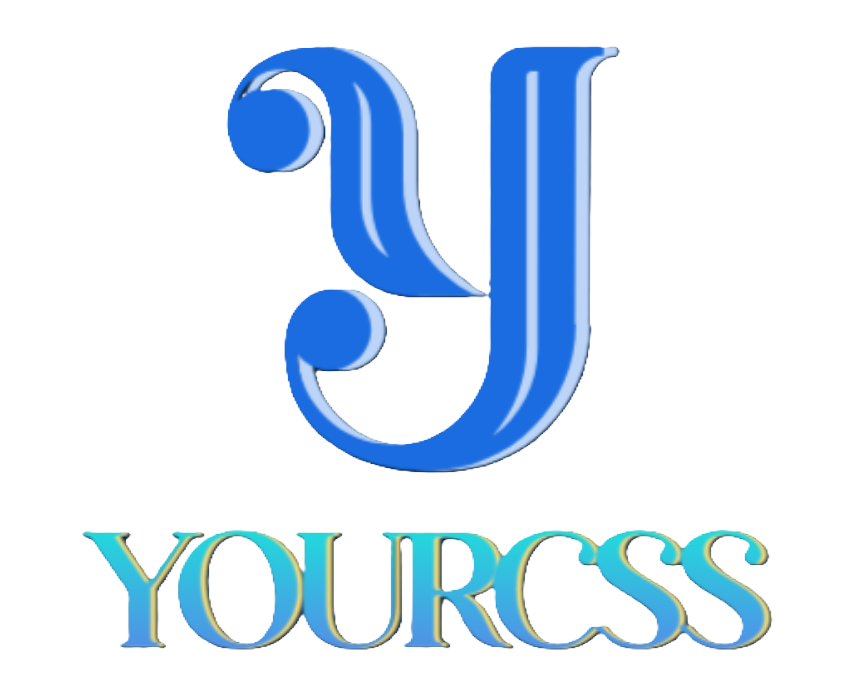

<p align="center">
  
</p>

<div align="center">

#  YourCSS Project

### *Your One-Stop Destination for Beautiful CSS Designs*

[](https://hacktoberfest.com/)
[](https://nextjs.org/)
[](https://tailwindcss.com/)
[](./LICENSE)
[](./CONTRIBUTING.md)
[](https://yourcss.vercel.app/)

[🌐 Live Demo](https://yourcss.vercel.app/) • [📖 Documentation](#-installation) • [🤝 Contributing](./CONTRIBUTING.md) • [💬 Community](#-community)

</div>

---

## 📑 Table of Contents

- [About the Project](#-about-the-project)
- [Screenshots](#-screenshots)
- [Features](#-features)
- [Technologies Used](#️-technologies-used)
- [Installation](#-installation)
- [Contributing](#-contributing)
- [Community](#-community)
- [Contact](#-contact)
- [License](#-license)
- [Acknowledgements](#-acknowledgements)
- [Show Your Support](#-show-your-support)

---

## 📖 About the Project

Welcome to **YourCSS** – a modern web application designed to help developers **explore, interact with, and copy beautiful CSS designs** effortlessly! 🎨✨ 

Whether you're a beginner looking for inspiration or an experienced developer seeking ready-to-use components, YourCSS provides a curated collection of stunning CSS snippets for buttons, forms, layouts, and more. Our platform makes it incredibly easy to find the perfect design and integrate it into your projects with just one click!

### 🎯 Why YourCSS?

- **Time-Saver**: No need to write CSS from scratch
- **Quality Designs**: Handpicked, modern, and responsive components
- **Learning Resource**: Great for understanding CSS techniques
- **Free & Open Source**: Community-driven project welcoming contributions

🔗 **Live Demo**: [https://yourcss.vercel.app/](https://yourcss.vercel.app/)

---

## 📸 Screenshots

<div align="center">

### Home Page


### CSS Components Gallery


### Interactive Preview


### Code Snippet View


</div>

---

## 🚀 Features

✨ **Core Features:**

* 🎨 **Browse CSS Designs** – Explore a wide range of pre-made, professional CSS designs
* 📋 **One-Click Copy** – Instantly copy CSS snippets to your clipboard with a single click
* 🖥️ **User-Friendly Interface** – Simple, clean, and intuitive design for seamless navigation
* 📱 **Fully Responsive** – Works flawlessly across desktops, tablets, and mobile devices
* ⚡ **Live Interactive Components** – Preview designs in action before using them
* 🔍 **Easy Search & Filter** – Quickly find the components you need
* 🎯 **Organized Categories** – Designs sorted by type (buttons, forms, cards, etc.)
* 💾 **Save Favorites** – Bookmark your favorite designs for quick access

---

## 🛠️ Technologies Used

<div align="center">

| Technology | Description |
|------------|-------------|
|  | React-based framework for building efficient, server-rendered web applications |
|  | Utility-first CSS framework for rapid, modern styling |
|  | Programming language for dynamic functionality and interactivity |
|  | Deployment platform for seamless hosting and CI/CD |

</div>

---

## 📥 Installation

Follow these steps to run **YourCSS** locally on your machine:

### ✅ Prerequisites

Before you begin, ensure you have the following installed:
- **[Node.js](https://nodejs.org/)** (v16 or higher)
- **npm** or **yarn** package manager

### ⚙️ Setup Instructions

1️⃣ **Clone the repository**
```bash
git clone https://github.com/Gyanthakur/yourcss_contribution.git
```

2️⃣ **Navigate to the project directory**
```bash
cd yourcss_contribution
```

3️⃣ **Install dependencies**
```bash
npm install
# or
yarn install
```

4️⃣ **Run the development server**
```bash
npm run dev
# or
yarn dev
```

5️⃣ **Open in browser**

Navigate to 👉 [http://localhost:3000](http://localhost:3000) to view the project locally.

### 🏗️ Build for Production
```bash
npm run build
npm start
```

---

## 🤝 Contributing

We **love** contributions! 🎉 YourCSS is an open-source project, and we welcome developers of all skill levels to contribute.

### 🌟 How to Contribute

1. **Fork** this repository
2. **Clone** your forked repository
3. Create a new **branch** (`git checkout -b feature/amazing-feature`)
4. Make your changes and **commit** (`git commit -m 'Add some amazing feature'`)
5. **Push** to the branch (`git push origin feature/amazing-feature`)
6. Open a **Pull Request**

### 📋 Contribution Guidelines

For detailed guidelines on how to contribute, please read our [CONTRIBUTING.md](./CONTRIBUTING.md) file.

### 🎃 Hacktoberfest 2025

This project is participating in **Hacktoberfest 2025**! We welcome quality contributions that follow our guidelines. Make sure to:
- Read the contribution guidelines carefully
- Create meaningful pull requests
- Follow the code of conduct
- Be respectful and collaborative

---

## 👥 Community

Join our growing community of developers! 🌟

### 📚 Important Links

- 📖 **[Contributing Guidelines](./CONTRIBUTING.md)** – Learn how to contribute
- 📜 **[Code of Conduct](./CODE_OF_CONDUCT.md)** – Our community standards
- 🐛 **[Report Issues](https://github.com/Gyanthakur/yourcss_contribution/issues)** – Help us improve
- 💡 **[Request Features](https://github.com/Gyanthakur/yourcss_contribution/issues/new)** – Share your ideas

### 💬 Get in Touch

- 📲 **WhatsApp**: [Join our community](https://wa.me/918957818597?text=Hey%20%F0%9F%91%8B%2C%20I%20want%20to%20contribute%20to%20YourCSS)
- 📧 **Email**: [gps.96169@gmail.com](mailto:gps.96169@gmail.com)

---

## 📬 Contact

Have questions, suggestions, or just want to say hi? 👋

📲 **WhatsApp**: [Click Here](https://wa.me/918957818597?text=Hey%20%F0%9F%91%8B%2C%20I%20want%20to%20contribute%20to%20YourCSS)

📧 **Email**: [gps.96169@gmail.com](mailto:gps.96169@gmail.com)

💼 **GitHub**: [@Gyanthakur](https://github.com/Gyanthakur)

---

## 📄 License

This project is licensed under the **MIT License** – see the [LICENSE](./LICENSE) file for details.
```
MIT License - feel free to use this project for personal or commercial purposes!
```

---

## 🙏 Acknowledgements

A big thank you to everyone who has contributed to making YourCSS better! 💖

### 👨‍💻 Contributors

Thanks to all the amazing people who have contributed to this project:

<a href="https://github.com/Gyanthakur/yourcss_contribution/graphs/contributors">
  
</a>

### 🌟 Special Thanks

- **[Next.js Team](https://nextjs.org/)** – For the incredible framework
- **[Tailwind CSS](https://tailwindcss.com/)** – For making styling a breeze
- **[Vercel](https://vercel.com/)** – For seamless deployment
- **[Hacktoberfest](https://hacktoberfest.com/)** – For promoting open source
- **All our contributors** – For your valuable time and effort

### 💡 Inspiration

This project was inspired by the need for a centralized, easy-to-use platform where developers can discover and implement beautiful CSS designs without the hassle.

---

## ⭐ Show Your Support

If you find **YourCSS** helpful, please consider giving it a star! ⭐

Your support motivates us to keep improving and adding more features. 🚀

### 🌟 Why Star This Repo?

- ⭐ **Show appreciation** for the work
- 📈 **Help others discover** this project
- 🔔 **Stay updated** with new features
- 💪 **Support open source** development

<div align="center">

### 🔗 Share YourCSS

[](https://twitter.com/intent/tweet?text=Check%20out%20YourCSS%20-%20A%20collection%20of%20beautiful%20CSS%20designs!&url=https://github.com/Gyanthakur/yourcss_contribution)
[](https://www.linkedin.com/sharing/share-offsite/?url=https://github.com/Gyanthakur/yourcss_contribution)
[](https://www.facebook.com/sharer/sharer.php?u=https://github.com/Gyanthakur/yourcss_contribution)

**[⬆ Back to Top](#-yourcss-project)**

---

<p align="center">Made with ❤️ by the YourCSS Community</p>
<p align="center">⭐ Star this repo if you find it useful! ⭐</p>

</div>